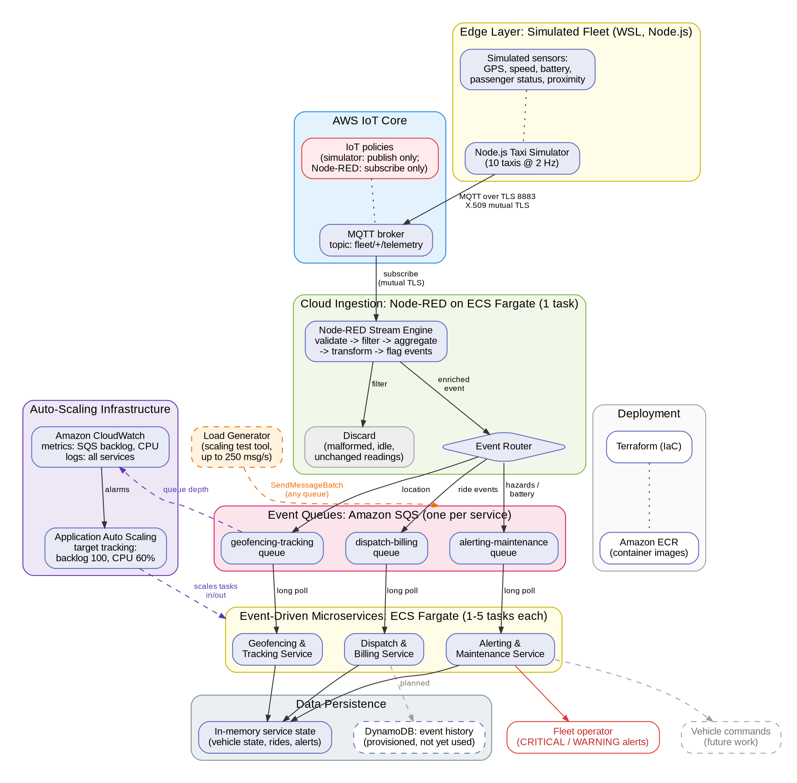

# Cloud-Native Autonomous Fleet Management for a Driver-less Taxi System

**SIT314/SIT729 Distinction Project** — Mackenzie Turley (s224876985), Deakin University

A scalable, event-driven IoT backend for a simulated fleet of autonomous taxis in Melbourne. Vehicle telemetry is published over MQTT with mutual TLS to **AWS IoT Core**, processed by a **Node-RED** stream engine, and routed through **Amazon SQS** to three independently scalable **Node.js** microservices on **Amazon ECS Fargate**. All infrastructure is defined in **Terraform**.



## Architecture

| Layer | Implementation |
|---|---|
| Edge (simulated fleet) | Node.js simulator publishing JSON telemetry (GPS, speed, battery, passenger status, proximity) |
| Ingestion | AWS IoT Core MQTT broker, X.509 mutual-TLS device certificates, least-privilege IoT policies |
| Stream processing | Node-RED on ECS Fargate: validation, filtering, aggregation, transformation, event flagging, routing |
| Event queues | One Amazon SQS queue per microservice |
| Microservices | Geofencing & Tracking, Dispatch & Billing, Alerting & Maintenance on ECS Fargate (1–5 tasks each) |
| Auto-scaling | Application Auto Scaling target tracking on SQS backlog (target 100 messages) and CPU (target 60%) |
| Observability | Amazon CloudWatch metrics, alarms and logs |
| Infrastructure as code | Terraform, with container images stored in Amazon ECR |

A Level 1 data flow diagram is in [`docs/data-flow-diagram.png`](docs/data-flow-diagram.png). Both diagrams can be regenerated from their Graphviz sources with `dot -Tpng docs/<name>.dot -o docs/<name>.png`.

### Data processing in Node-RED

Telemetry passes through the processing stages in series:

1. **Validation** — rejects payloads missing required fields
2. **Filtering** — drops repeated idle (0 km/h) readings and insignificant changes
3. **Transformation** — converts coordinates to GeoJSON for spatial querying
4. **Temporal aggregation** — rolling average speed over the last 10 readings
5. **Spatial aggregation** — vehicle counts per ~100 m grid zone
6. **Event flagging** — e.g. `SUSPECTED_CRASH` (sharp deceleration with a proximity warning), `LOW_BATTERY`
7. **Routing** — flagged events to the Alerting queue, ride events to the Dispatch queue, all other location updates to the Geofencing queue

## Repository layout

```
simulator/             Taxi telemetry simulator (MQTT, mutual TLS), local MQTT broker
                       and worker-threads stress test
node-red/local/        Node-RED flow for local development (routes to services over HTTP)
node-red/aws/          Node-RED flow, settings and Dockerfile for AWS (publishes to SQS)
microservices/         geofencing-tracking, dispatch-billing, alerting-maintenance,
                       plus shared/ SQS long-poll consumer
load-generator/        sqs-burst.js (controlled load injection into SQS) and
                       monitor.sh (records scaling behaviour to CSV)
infra/terraform/       IoT Core, SQS, ECS Fargate, ECR, DynamoDB, CloudWatch and
                       Application Auto Scaling
docs/                  Architecture and data flow diagrams
results/               Monitoring data from the auto-scaling experiments
docker-compose.yml     Local development stack
```

## Deploying to AWS Academy Learner Lab

Prerequisites: AWS CLI v2, Terraform, Docker and Node.js 20 (tested in WSL Ubuntu).

> **Note:** the Terraform, Node-RED flow and ECR image references contain the account ID and IoT endpoint of the original deployment. Replace them with your own before deploying.

1. **Credentials.** Copy the Learner Lab *AWS CLI* credentials into `~/.aws/credentials` and set the region to `us-east-1`.
2. **Create the ECR repositories.**
   ```bash
   cd infra/terraform
   terraform init
   terraform apply -target=aws_ecr_repository.microservice_repo -target=aws_ecr_repository.node_red_repo
   ```
3. **Build and push the images** (the microservices use `microservices/` as the build context because of the shared module):
   ```bash
   aws ecr get-login-password --region us-east-1 | docker login --username AWS --password-stdin <account>.dkr.ecr.us-east-1.amazonaws.com
   docker build -f microservices/geofencing-tracking/Dockerfile -t <ecr-url>/fleet-geofencing-tracking:latest microservices
   docker push <ecr-url>/fleet-geofencing-tracking:latest
   # repeat for dispatch-billing and alerting-maintenance
   ```
4. **Deploy the rest of the infrastructure.**
   ```bash
   terraform apply
   ```
5. **Retrieve the IoT certificates** into `certs/` (git-ignored):
   ```bash
   mkdir -p ../../certs
   terraform output -raw simulator_certificate_pem > ../../certs/simulator-cert.pem
   terraform output -raw simulator_private_key     > ../../certs/simulator-private.key
   terraform output -raw node_red_certificate_pem  > ../../certs/node-red-cert.pem
   terraform output -raw node_red_private_key      > ../../certs/node-red-private.key
   curl -o ../../certs/AmazonRootCA1.pem https://www.amazontrust.com/repository/AmazonRootCA1.pem
   ```
6. **Build and push Node-RED** after copying `node-red-cert.pem`, `node-red-private.key` and `AmazonRootCA1.pem` into `node-red/aws/certs/`:
   ```bash
   docker build -t <ecr-url>/fleet-node-red:latest node-red/aws
   docker push <ecr-url>/fleet-node-red:latest
   aws ecs update-service --cluster fleet-cluster --service node-red --force-new-deployment
   ```

## Running the simulator

Create `simulator/.env` (git-ignored):

```
MQTT_URL=mqtts://<your-iot-endpoint>:8883
MQTT_CA_CERT_PATH=../certs/AmazonRootCA1.pem
MQTT_CLIENT_CERT_PATH=../certs/simulator-cert.pem
MQTT_CLIENT_KEY_PATH=../certs/simulator-private.key
FLEET_SIZE=10
PUBLISH_HZ=2
```

Then run `npm install && node simulator.js` in `simulator/`. For local development without AWS, use `docker compose up` and the local flow in `node-red/local/`.

## Auto-scaling experiments

A single IoT Core client connection is throttled to roughly 100 publishes per second, so scaling tests inject load directly into a microservice's SQS queue to isolate the microservice layer.

```bash
cd load-generator && npm install
./monitor.sh geofencing-tracking                                      # terminal 1: records CSV every 30 s
QUEUE=geofencing-tracking RATE=250 DURATION_SEC=600 node sqs-burst.js # terminal 2: applies load
```

### Results (Geofencing & Tracking service)

| Measure | Run 1: 150 msg/s | Run 2: 250 msg/s for 10 min |
|---|---|---|
| Peak backlog with 1 task | 821 | 26,575 |
| Load start to scale-out | ≈ 5 min (1 → 5 tasks) | ≈ 4.5 min (1 → 5 tasks) |
| Scale-out to tasks running | < 1 min | < 1 min |
| Backlog cleared | within 1 min of scaling | ≈ 90 s, under continuing load |
| Messages sent / failed | continuous run | 149,825 / 0 |
| Scale-in | manually reset | automatic, ≈ 2 min after load ended |

Key findings:

- **Near-linear scaling:** one task processed ≈ 150–170 msg/s; five tasks processed ≈ 750 msg/s.
- **Independent scaling:** only the loaded service scaled; the other services stayed at one task.
- **Scaling trigger:** both CPU and backlog exceeded their targets under load; the recorded scale-out was triggered by the backlog policy, which moved directly from 1 to 5 tasks because target tracking scales in proportion to the overshoot.
- **Resilience:** when the Alerting service was unavailable, SQS held 91 messages, all of which were processed after it recovered.

Raw monitoring data is in [`results/`](results/).

## Security

- Devices authenticate to IoT Core with individual X.509 certificates over mutual TLS; there are no passwords.
- IoT policies follow least privilege: the simulator may only **publish** to `fleet/*/telemetry`, and Node-RED may only **subscribe** and **receive**.
- Certificates, private keys, `.env` files and Terraform state are excluded from version control.
- Learner Lab does not allow creating IAM roles, so all ECS tasks run under the provided `LabRole`. A production deployment would use a separate least-privilege task role per service.

## Limitations and design decisions

- **Single Node-RED instance:** Node-RED uses a fixed MQTT client ID, so two instances disconnect each other. ECS is configured to stop the old task before starting a new one during deployments. MQTT shared subscriptions would allow horizontal scaling.
- **IoT Core connection throttling** limits the load a single simulator connection can generate.
- **Maximum of five tasks per service** to protect the Learner Lab budget; production limits should be set from measured per-task throughput and expected peak load.
- **Persistence:** DynamoDB is provisioned but not yet written to; services currently keep state in memory. MongoDB was not deployed.
- **No API Gateway or load balancer:** ingestion is through IoT Core, and services pull work from SQS rather than receiving HTTP traffic.
- **Vehicle commands** (actuators) are not implemented; the Alerting service raises alerts only.

## Technologies

Node.js 20, Node-RED 4.1, AWS IoT Core, Amazon SQS, Amazon ECS Fargate, Amazon ECR, Application Auto Scaling, Amazon CloudWatch, Amazon DynamoDB, Terraform, Docker.
